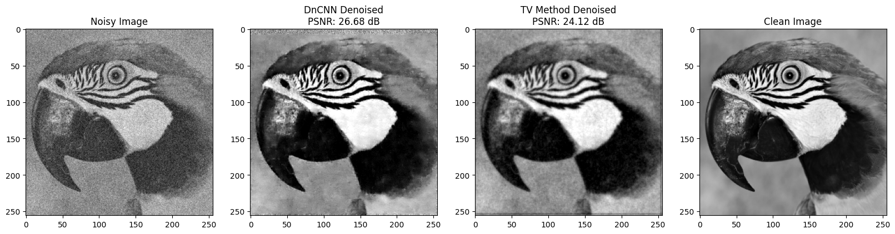
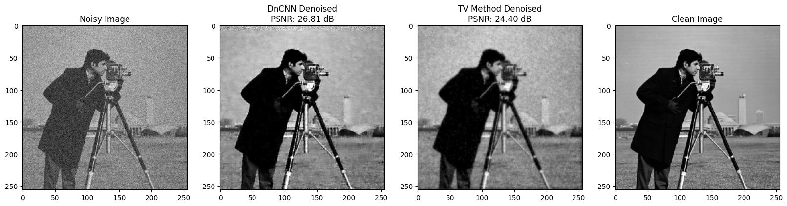

# Image Denoising Comparison: Total Variation vs. DnCNN

## Purpose

The inspiration for this project came from coursework where we applied Total Variation denoising and learned about the Barzilai-Borwein (BB) optimization method, a Hessian-free approach that approximates Newton’s method using step sizes from finite gradient differences. This project builds on that foundation by implementing TV denoising with BB optimization and comparing it to the DnCNN model, a deep learning approach from the paper ["Beyond a Gaussian Denoiser: Residual Learning of Deep CNN for Image Denoising" by Kai Zhang et al.](https://arxiv.org/abs/1608.03981). The goal is to see how well deep learning methods can handle denoising in comparison to classical techniques.


## Methods Overview

1. **Total Variation (TV) Method**:
   - Implements a gradient descent optimization using the Barzilai-Borwein method.
   - Optimizes for smoothness by reducing the total variation in the image.
   - Suitable for removing noise while preserving edges.

2. **DnCNN (Deep CNN)**:
   - A neural network-based approach that directly learns the residual noise and subtracts it from the noisy image.
   - Uses a residual learning framework, making it effective for complex noise patterns.
   - Trained using residual mappings for more accurate noise estimation.

## Evaluation Metric

To assess denoising quality, we use **Peak Signal-to-Noise Ratio (PSNR)**. A higher PSNR value indicates a cleaner, more accurate denoised image.

### Example Comparisons



The **DnCNN method** is expected to handle complex noise patterns effectively, often achieving higher PSNR values compared to the **TV method**, which may be better at preserving edges but less capable with complex noise.

These results demonstrate that DnCNN generally produces higher PSNR values, indicating better denoising performance, especially on complex noise patterns.

## Instructions for Execution

### Total Variation Denoising (TV Denoising)

To execute TV denoising on an image file, use the following command:

```bash
python tv_denoising.py input_image.png output_image.png --target_size 256 256 --lambd 1.0 --max_iterations 500 --eps 1e-8
```

To execute DnCNN denoising on an image file, use the following command:

```bash
python dncnn_denoising.py input_image.png output_image.png --weights dncnn_model.pth --target_size 256 256 --contrast_factor 1.15
```

---
